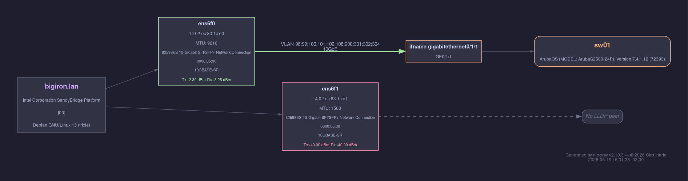
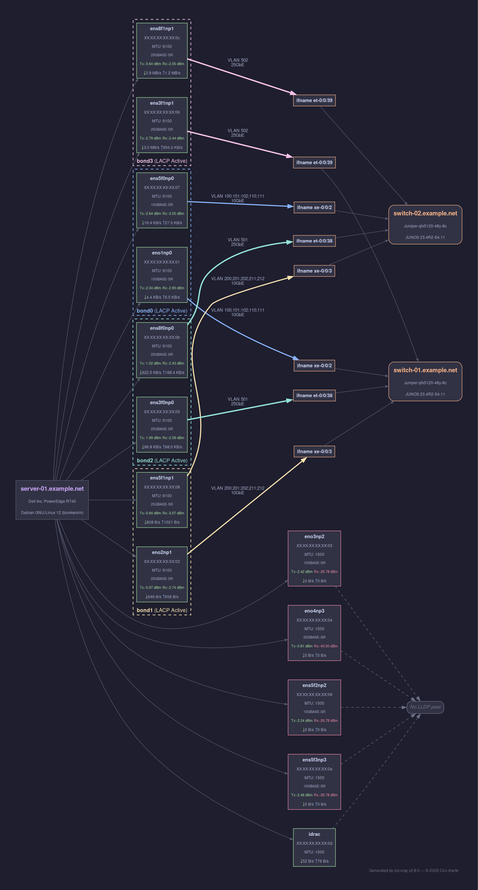

# nic-xray

Detailed physical network interface diagnostics for Linux.

[](https://github.com/ciroiriarte/nic-xray/releases)
[](LICENSE)

## Table of Contents

- [Description](#-description)
- [Features](#-features)
- [Requirements](#%EF%B8%8F-requirements)
- [Installation](#-installation)
- [Usage](#-usage)
- [Output Examples](#-output-examples)
- [License](#-license)
- [Contributing](#-contributing)
- [Authors](#%EF%B8%8F-authors)

## 📝 Description

`nic-xray.sh` is a diagnostic script that provides a detailed overview of all **physical network interfaces** on a Linux system. It displays:

- PCI slot
- Driver name
- Firmware version
- Interface name
- MAC address
- MTU
- Link status (with color)
- Negotiated speed and duplex (color-coded by speed tier)
- Bond membership (with color)
- LLDP peer information (switch, port, and port description)
- Optionally: LACP status, VLAN tagging, bond MAC address
- SFP/QSFP optical transceiver diagnostics: Tx/Rx power levels, health status (with `--optics`)
- Physical topology: NUMA node, PCI slot, NIC vendor/model (with `--physical`)
- Real-time traffic metrics: bandwidth, packets/s, drops, errors, FIFO errors (with `--metrics`)

Supports multiple output formats: **table** (default, with dynamic column widths), **CSV**, **JSON**, and **network topology diagrams** (DOT/SVG/PNG).

Originally developed for OpenStack node deployments, it is suitable for any Linux environment.

## 🔍 Features

| Category | Feature | Details |
|----------|---------|---------|
| **Hardware** | PCI slot | Bus address for each physical NIC |
| | Driver & firmware | Kernel driver name and firmware version |
| | Interface name | Predictable network device name |
| | MAC address | Hardware address |
| | MTU | Maximum transmission unit |
| **Link** | Status | Up/down with color coding |
| | Speed & duplex | Negotiated link speed, color-coded by tier |
| **Bonding** | Bond membership | Parent bond device |
| | Bond MAC (`--bmac`) | Bridge MAC address of the bond |
| | LACP status (`--lacp`) | Aggregator ID and LACP partner MAC |
| **Switching** | LLDP peer | Connected switch name, port, and port description |
| | Cisco ACI support | Automatic detection of ACI fabric switches via vendor TLVs |
| | VLAN tagging (`--vlan`) | Tagged VLANs with PVID identification |
| **Optics** (`--optics`) | SFP/QSFP type | Transceiver module identification |
| | Tx/Rx power | Optical signal levels in dBm |
| | Health status | OK / WARN / ALARM based on DOM thresholds |
| | Multi-lane support | Per-channel diagnostics for QSFP+/QSFP28 |
| | Lane variance | Flags outlier channels with >2 dB deviation |
| **Physical** (`--physical`) | NUMA node | CPU/memory affinity for each NIC |
| | PCI slot | Shared PCI slot groups multi-port NICs |
| | NIC vendor/model | Hardware identification via `lspci` |
| **Metrics** (`--metrics`) | Bandwidth | Real-time Rx/Tx bytes/s (human-readable) |
| | Packets/s | Rx/Tx packet rates |
| | Drops & errors | Rx/Tx drops, errors, and FIFO errors |
| **Output** | Table | Dynamic column widths, optional separators |
| | CSV | Machine-readable, configurable delimiter |
| | JSON | Structured output with nested objects |
| | DOT / SVG / PNG | Network topology diagrams (Catppuccin Mocha theme) |
| **Filtering** | Link filter | Show only up or down interfaces |
| | Bond grouping | Sort and group rows by bond membership |
| | Color control | Auto-detect TTY, `--no-color` override |

## ⚙️ Requirements

- Must be run as **root**
- Required tools:
  - `ethtool`
  - `lldpctl`
  - `ip`, `awk`, `grep`, `cat`, `readlink`
- Optional tools:
  - `graphviz` (`dot` command) — required for `--output svg` and `--output png`; not needed for `--output dot`
  - `dmidecode` — used by `--physical` for physical slot designations (e.g., "PCIe Slot 3"); falls back to bus address if absent
  - `lspci` (from `pciutils`) — used by `--physical` for NIC vendor/model names; falls back to raw PCI IDs if absent
- Switch configuration:
  - Switch should advertise LLDP messages
  - Cisco doesn't include VLAN information by default.
    Hint:
    ```bash
    lldp tlv-select vlan-name
    ```

## 📦 Installation

### Script

Copy to `/usr/local/sbin` for easy access:

```bash
sudo cp nic-xray.sh /usr/local/sbin/
sudo chmod +x /usr/local/sbin/nic-xray.sh
```

### Man page

A man page is available under `man/man8/` for detailed reference (section 8: system administration commands).

**Preview locally** (no installation required):

```bash
man -l man/man8/nic-xray.8
```

**Install system-wide:**

```bash
sudo make install-man
```

After installation, use `man nic-xray` to view the man page.

**Uninstall:**

```bash
sudo make uninstall-man
```

### Bash completion

A bash completion script is provided for tab-completion of all options.

**Source in current session:**

```bash
source completions/nic-xray.bash
```

**Install system-wide:**

```bash
sudo make install-completion
```

**Uninstall:**

```bash
sudo make uninstall-completion
```

### lldpd service

Ensure lldpd is running to retrieve LLDP information:

```bash
sudo systemctl enable --now lldpd
```

## 🚀 Usage

### Basic

```bash
sudo nic-xray.sh              # Default view
sudo nic-xray.sh --all        # All optional columns at once
sudo nic-xray.sh -h           # Display help
sudo nic-xray.sh -v           # Display version
```

### Optional columns

```bash
sudo nic-xray.sh --lacp       # Show LACP peer information
sudo nic-xray.sh --vlan       # Show VLAN information
sudo nic-xray.sh --bmac       # Show bond MAC address
sudo nic-xray.sh --optics     # Show SFP/QSFP transceiver diagnostics
sudo nic-xray.sh --physical   # Show NUMA node, PCI slot, NIC vendor/model
```

### Traffic metrics

```bash
sudo nic-xray.sh --metrics             # Sample metrics over 30s (default)
sudo nic-xray.sh --metrics=5           # Sample metrics over 5s
sudo nic-xray.sh --metrics --output csv   # Metrics as raw numeric CSV columns
sudo nic-xray.sh --metrics --output json  # Metrics as nested JSON object
```

### Filtering and sorting

```bash
sudo nic-xray.sh --filter-link up      # Only interfaces with link up
sudo nic-xray.sh --filter-link down    # Only interfaces with link down
sudo nic-xray.sh --group-bond          # Group rows by bond
sudo nic-xray.sh --group-bond --all -s # Combined example
```

### Output formats

```bash
sudo nic-xray.sh --output csv                     # CSV output
sudo nic-xray.sh --output csv --separator='|'      # Pipe-delimited CSV
sudo nic-xray.sh --output csv --separator=$'\t'    # Tab-separated CSV
sudo nic-xray.sh --output json                     # JSON output
sudo nic-xray.sh --all --output json               # All columns as JSON
```

### Topology diagrams

```bash
sudo nic-xray.sh --output dot > topology.dot                   # DOT source
sudo nic-xray.sh --output svg                                  # SVG diagram
sudo nic-xray.sh --output png --diagram-out /tmp/network.png   # PNG with custom path
```

### Formatting

```bash
sudo nic-xray.sh -s                # Table with │ column separators
sudo nic-xray.sh --separator='|'   # Table with custom separator
sudo nic-xray.sh --no-color        # Disable color output
```

## 📸 Output Examples

> MAC addresses and hostnames below are obfuscated. Full sample files are available in [`samples/`](samples/).

### Default table

```
$ sudo nic-xray.sh
Device         Driver      Firmware                 Interface   MAC Address         MTU    Link   Speed/Duplex       Parent Bond   Switch Name                   Port Name          Port Descr
----------------------------------------------------------------------------------------------------------------------------------------------------------------------------------------------
0000:19:00.0   i40e        9.50 0x8000f25e 23.0.8   eno1np0     XX:XX:XX:XX:XX:01   9100   up     10000Mb/s (Full)   bond0         switch-01.example.net   ifname xe-0/0/2    xe-0/0/2
0000:19:00.1   i40e        9.50 0x8000f25e 23.0.8   eno2np1     XX:XX:XX:XX:XX:02   9100   up     10000Mb/s (Full)   bond1         switch-01.example.net   ifname xe-0/0/3    xe-0/0/3
0000:19:00.2   i40e        9.50 0x8000f25e 23.0.8   eno3np2     XX:XX:XX:XX:XX:03   1500   down   N/A (N/A)          None                                                           N/A
0000:19:00.3   i40e        9.50 0x8000f25e 23.0.8   eno4np3     XX:XX:XX:XX:XX:04   1500   down   N/A (N/A)          None                                                           N/A
0000:5e:00.0   i40e        9.50 0x8000f251 23.0.8   ens3f0np0   XX:XX:XX:XX:XX:05   9100   up     25000Mb/s (Full)   bond2         switch-01.example.net   ifname et-0/0/38   et-0/0/38
0000:5e:00.1   i40e        9.50 0x8000f251 23.0.8   ens3f1np1   XX:XX:XX:XX:XX:06   9100   up     25000Mb/s (Full)   bond3         switch-01.example.net   ifname et-0/0/39   et-0/0/39
0000:86:00.0   i40e        9.50 0x8000f25d 23.0.8   ens5f0np0   XX:XX:XX:XX:XX:07   9100   up     10000Mb/s (Full)   bond0         switch-02.example.net   ifname xe-0/0/2    xe-0/0/2
0000:86:00.1   i40e        9.50 0x8000f25d 23.0.8   ens5f1np1   XX:XX:XX:XX:XX:08   9100   up     10000Mb/s (Full)   bond1         switch-02.example.net   ifname xe-0/0/3    xe-0/0/3
0000:86:00.2   i40e        9.50 0x8000f25d 23.0.8   ens5f2np2   XX:XX:XX:XX:XX:09   1500   down   N/A (N/A)          None                                                           N/A
0000:86:00.3   i40e        9.50 0x8000f25d 23.0.8   ens5f3np3   XX:XX:XX:XX:XX:0a   1500   down   N/A (N/A)          None                                                           N/A
0000:d8:00.0   i40e        9.50 0x8000f251 23.0.8   ens8f0np0   XX:XX:XX:XX:XX:0b   9100   up     25000Mb/s (Full)   bond2         switch-02.example.net   ifname et-0/0/38   et-0/0/38
0000:d8:00.1   i40e        9.50 0x8000f251 23.0.8   ens8f1np1   XX:XX:XX:XX:XX:0c   9100   up     25000Mb/s (Full)   bond3         switch-02.example.net   ifname et-0/0/39   et-0/0/39
1-14.3:1.0     cdc_ether   CDC Ethernet Device      idrac       XX:XX:XX:XX:XX:0d   1500   up     425Mb/s (Half)     None                                                           N/A
```

### All columns with separators

```
$ sudo nic-xray.sh --all -s
NUMA │ PCI Slot    │ NIC Model                                  │ Device       │ Driver    │ Firmware               │ Interface │ MAC Address       │ MTU  │ Link │ Speed/Duplex     │ Parent Bond │ Bond MAC          │ LACP Status                    │ VLAN                │ SFP Type   │ Optics Tx │ Optics Rx    │ Switch Name                 │ Port Name        │ Port Descr
-----------------------------------------------------------------------------------------------------------------------------------------------------------------------------------------------------------------------------------------------------------------------------------------------------------------------------------------------------------------------------------
0    │ 0000:19:00  │ Ethernet Controller X710 for 10GbE SFP+    │ 0000:19:00.0 │ i40e      │ 9.50 0x8000f25e 23.0.8 │ eno1np0   │ XX:XX:XX:XX:XX:01 │ 9100 │ up   │ 10000Mb/s (Full) │ bond0       │ XX:XX:XX:XX:XX:01 │ AggID:1 Peer:AA:BB:CC:DD:EE:01 │ 100;101;102;110;111 │ 10GBASE-SR │ -2.36 OK  │ -2.90 OK     │ switch-01.example.net │ ifname xe-0/0/2  │ xe-0/0/2
0    │ 0000:19:00  │ Ethernet Controller X710 for 10GbE SFP+    │ 0000:19:00.1 │ i40e      │ 9.50 0x8000f25e 23.0.8 │ eno2np1   │ XX:XX:XX:XX:XX:02 │ 9100 │ up   │ 10000Mb/s (Full) │ bond1       │ XX:XX:XX:XX:XX:02 │ AggID:1 Peer:AA:BB:CC:DD:EE:02 │ 200;201;202;211;212 │ 25GBASE-SR │ -0.97 OK  │ -2.79 OK     │ switch-01.example.net │ ifname xe-0/0/3  │ xe-0/0/3
0    │ 0000:19:00  │ Ethernet Controller X710 for 10GbE SFP+    │ 0000:19:00.2 │ i40e      │ 9.50 0x8000f25e 23.0.8 │ eno3np2   │ XX:XX:XX:XX:XX:03 │ 1500 │ down │ N/A (N/A)        │ None        │ N/A               │ N/A                            │ N/A                 │ 10GBASE-SR │ -2.43 OK  │ -26.78 ALARM │                             │                  │ N/A
...
```

### Filtering — link down only

```
$ sudo nic-xray.sh --filter-link down
Device         Driver   Firmware                 Interface   MAC Address         MTU    Link   Speed/Duplex   Parent Bond   Switch Name   Port Name   Port Descr
----------------------------------------------------------------------------------------------------------------------------------------------------------------
0000:19:00.2   i40e     9.50 0x8000f25e 23.0.8   eno3np2     XX:XX:XX:XX:XX:03   1500   down   N/A (N/A)      None                                    N/A
0000:19:00.3   i40e     9.50 0x8000f25e 23.0.8   eno4np3     XX:XX:XX:XX:XX:04   1500   down   N/A (N/A)      None                                    N/A
0000:86:00.2   i40e     9.50 0x8000f25d 23.0.8   ens5f2np2   XX:XX:XX:XX:XX:09   1500   down   N/A (N/A)      None                                    N/A
0000:86:00.3   i40e     9.50 0x8000f25d 23.0.8   ens5f3np3   XX:XX:XX:XX:XX:0a   1500   down   N/A (N/A)      None                                    N/A
```

### Physical topology

```
$ sudo nic-xray.sh --physical
NUMA   PCI Slot      NIC Model                                    Device         Driver      Firmware                 Interface   MAC Address         MTU    Link   Speed/Duplex       Parent Bond   Switch Name                   Port Name          Port Descr
----------------------------------------------------------------------------------------------------------------------------------------------------------------------------------------------------------------------------------------------------------------
0      0000:19:00    Ethernet Controller X710 for 10GbE SFP+      0000:19:00.0   i40e        9.50 0x8000f25e 23.0.8   eno1np0     XX:XX:XX:XX:XX:01   9100   up     10000Mb/s (Full)   bond0         switch-01.example.net   ifname xe-0/0/2    xe-0/0/2
0      0000:19:00    Ethernet Controller X710 for 10GbE SFP+      0000:19:00.1   i40e        9.50 0x8000f25e 23.0.8   eno2np1     XX:XX:XX:XX:XX:02   9100   up     10000Mb/s (Full)   bond1         switch-01.example.net   ifname xe-0/0/3    xe-0/0/3
0      0000:19:00    Ethernet Controller X710 for 10GbE SFP+      0000:19:00.2   i40e        9.50 0x8000f25e 23.0.8   eno3np2     XX:XX:XX:XX:XX:03   1500   down   N/A (N/A)          None                                                           N/A
0      0000:19:00    Ethernet Controller X710 for 10GbE SFP+      0000:19:00.3   i40e        9.50 0x8000f25e 23.0.8   eno4np3     XX:XX:XX:XX:XX:04   1500   down   N/A (N/A)          None                                                           N/A
0      PCIe Slot 3   Ethernet Controller XXV710 for 25GbE SFP28   0000:5e:00.0   i40e        9.50 0x8000f251 23.0.8   ens3f0np0   XX:XX:XX:XX:XX:05   9100   up     25000Mb/s (Full)   bond2         switch-01.example.net   ifname et-0/0/38   et-0/0/38
0      PCIe Slot 3   Ethernet Controller XXV710 for 25GbE SFP28   0000:5e:00.1   i40e        9.50 0x8000f251 23.0.8   ens3f1np1   XX:XX:XX:XX:XX:06   9100   up     25000Mb/s (Full)   bond3         switch-01.example.net   ifname et-0/0/39   et-0/0/39
1      PCIe Slot 5   Ethernet Controller X710 for 10GbE SFP+      0000:86:00.0   i40e        9.50 0x8000f25d 23.0.8   ens5f0np0   XX:XX:XX:XX:XX:07   9100   up     10000Mb/s (Full)   bond0         switch-02.example.net   ifname xe-0/0/2    xe-0/0/2
...
N/A    1-14.3:1      Unknown                                      1-14.3:1.0     cdc_ether   CDC Ethernet Device      idrac       XX:XX:XX:XX:XX:0d   1500   up     425Mb/s (Half)     None                                                           N/A
```

Shows NUMA node, PCI slot designation (from `dmidecode` when available, raw bus address otherwise), and NIC vendor/model. Interfaces sharing a PCI slot belong to the same physical NIC card.

### Optics diagnostics

```
$ sudo nic-xray.sh --optics
Device         Driver      Firmware                 Interface   MAC Address         MTU    Link   Speed/Duplex       Parent Bond   SFP Type     Optics Tx   Optics Rx      Switch Name                   Port Name          Port Descr
--------------------------------------------------------------------------------------------------------------------------------------------------------------------------------------------------------------------------------------
0000:19:00.0   i40e        9.50 0x8000f25e 23.0.8   eno1np0     XX:XX:XX:XX:XX:01   9100   up     10000Mb/s (Full)   bond0         10GBASE-SR   -2.32 OK    -2.90 OK       switch-01.example.net   ifname xe-0/0/2    xe-0/0/2
0000:19:00.1   i40e        9.50 0x8000f25e 23.0.8   eno2np1     XX:XX:XX:XX:XX:02   9100   up     10000Mb/s (Full)   bond1         25GBASE-SR   -0.97 OK    -2.80 OK       switch-01.example.net   ifname xe-0/0/3    xe-0/0/3
0000:19:00.2   i40e        9.50 0x8000f25e 23.0.8   eno3np2     XX:XX:XX:XX:XX:03   1500   down   N/A (N/A)          None          10GBASE-SR   -2.44 OK    -26.78 ALARM                                                    N/A
0000:19:00.3   i40e        9.50 0x8000f25e 23.0.8   eno4np3     XX:XX:XX:XX:XX:04   1500   down   N/A (N/A)          None          25GBASE-SR   -0.82 OK    -40.00 ALARM                                                    N/A
...
1-14.3:1.0     cdc_ether   CDC Ethernet Device      idrac       XX:XX:XX:XX:XX:0d   1500   up     425Mb/s (Half)     None          N/A          N/A N/A     N/A N/A                                                         N/A
```

Health status: **OK** (within normal range), **WARN** (approaching threshold), **ALARM** (beyond threshold or no signal), **N/DOM** (no DOM data), **N/A** (copper/no SFP).

### Traffic metrics table

```
$ sudo nic-xray.sh --all --metrics=6
NUMA   PCI Slot      NIC Model                                    Device         Driver      Firmware                 Interface   MAC Address         MTU    Link   Speed/Duplex       Parent Bond   Bond MAC            LACP Status                      VLAN                  SFP Type     Optics Tx   Optics Rx      Bandwidth                   Packets/s         Drops       Errors      FIFO Errors   Switch Name                   Port Name          Port Descr
-----------------------------------------------------------------------------------------------------------------------------------------------------------------------------------------------------------------------------------------------------------------------------------------------------------------------------------------------------------------------------------------------------------------------------------------------------------------------
0      0000:19:00    Ethernet Controller X710 for 10GbE SFP+      0000:19:00.0   i40e        9.50 0x8000f25e 23.0.8   eno1np0     XX:XX:XX:XX:XX:01   9100   up     10000Mb/s (Full)   bond0         XX:XX:XX:XX:XX:01   AggID:1 Peer:AA:BB:CC:DD:EE:01   100;101;102;110;111   10GBASE-SR   -2.32 OK    -2.90 OK       Rx:568 B/s Tx:755 B/s       Rx:3 Tx:4         Rx:0 Tx:0   Rx:0 Tx:0   Rx:0 Tx:0     switch-01.example.net   ifname xe-0/0/2    xe-0/0/2
0      PCIe Slot 3   Ethernet Controller XXV710 for 25GbE SFP28   0000:5e:00.1   i40e        9.50 0x8000f251 23.0.8   ens3f1np1   XX:XX:XX:XX:XX:06   9100   up     25000Mb/s (Full)   bond3         XX:XX:XX:XX:XX:06   AggID:1 Peer:AA:BB:CC:DD:EE:04   502                   25GBASE-SR   -2.79 OK    -2.63 OK       Rx:3.9 MB/s Tx:1.9 MB/s     Rx:2180 Tx:2098   Rx:0 Tx:0   Rx:0 Tx:0   Rx:0 Tx:0     switch-01.example.net   ifname et-0/0/39   et-0/0/39
...

📊 Metrics sampled over 6s
```

### CSV output

```
$ sudo nic-xray.sh --output csv
Device,Driver,Firmware,Interface,MAC Address,MTU,Link,Speed/Duplex,Parent Bond,Switch Name,Port Name,Port Descr
0000:19:00.0,i40e,9.50 0x8000f25e 23.0.8,eno1np0,XX:XX:XX:XX:XX:01,9100,up,10000Mb/s (Full),bond0,switch-01.example.net,ifname xe-0/0/2,xe-0/0/2
0000:19:00.1,i40e,9.50 0x8000f25e 23.0.8,eno2np1,XX:XX:XX:XX:XX:02,9100,up,10000Mb/s (Full),bond1,switch-01.example.net,ifname xe-0/0/3,xe-0/0/3
0000:19:00.2,i40e,9.50 0x8000f25e 23.0.8,eno3np2,XX:XX:XX:XX:XX:03,1500,down,N/A (N/A),None,,,N/A
...
```

### Optics CSV

```
$ sudo nic-xray.sh --optics --output csv
Device,Driver,Firmware,Interface,MAC Address,MTU,Link,Speed/Duplex,Parent Bond,SFP Type,SFP Vendor,Wavelength,Tx Power (dBm),Tx Status,Rx Power (dBm),Rx Status,Lane Count,Switch Name,Port Name,Port Descr
0000:19:00.0,i40e,9.50 0x8000f25e 23.0.8,eno1np0,XX:XX:XX:XX:XX:01,9100,up,10000Mb/s (Full),bond0,10GBASE-SR,DELL EMC,850nm,-2.32,OK,-2.90,OK,1,switch-01.example.net,ifname xe-0/0/2,xe-0/0/2
0000:19:00.2,i40e,9.50 0x8000f25e 23.0.8,eno3np2,XX:XX:XX:XX:XX:03,1500,down,N/A (N/A),None,10GBASE-SR,DELL EMC,850nm,-2.43,OK,-26.78,ALARM,1,,,N/A
...
```

### CSV with metrics

```
$ sudo nic-xray.sh --all --metrics=6 --output csv
NUMA,PCI Slot,NIC Model,Device,Driver,Firmware,Interface,MAC Address,MTU,Link,Speed/Duplex,Parent Bond,Bond MAC,LACP Status,VLAN,SFP Type,SFP Vendor,Wavelength,Tx Power (dBm),Tx Status,Rx Power (dBm),Rx Status,Lane Count,Rx Bytes/s,Tx Bytes/s,Rx Packets/s,Tx Packets/s,Rx Drops,Tx Drops,Rx Errors,Tx Errors,Rx FIFO Errors,Tx FIFO Errors,Sample Duration,Switch Name,Port Name,Port Descr
0,0000:19:00,Ethernet Controller X710 for 10GbE SFP+,0000:19:00.0,i40e,9.50 0x8000f25e 23.0.8,eno1np0,XX:XX:XX:XX:XX:01,9100,up,10000Mb/s (Full),bond0,XX:XX:XX:XX:XX:01,AggID:1 Peer:AA:BB:CC:DD:EE:01,100;101;102;110;111,10GBASE-SR,DELL EMC,850nm,-2.33,OK,-2.91,OK,1,3743,5593,4,6,0,0,0,0,0,0,6,switch-01.example.net,ifname xe-0/0/2,xe-0/0/2
0,PCIe Slot 3,Ethernet Controller XXV710 for 25GbE SFP28,0000:5e:00.1,i40e,9.50 0x8000f251 23.0.8,ens3f1np1,XX:XX:XX:XX:XX:06,9100,up,25000Mb/s (Full),bond3,XX:XX:XX:XX:XX:06,AggID:1 Peer:AA:BB:CC:DD:EE:04,502,25GBASE-SR,PRECISION,850nm,-2.79,OK,-2.45,OK,1,3721830,1362102,1683,1584,0,0,0,0,0,0,6,switch-01.example.net,ifname et-0/0/39,et-0/0/39
...
```

### JSON output

```
$ sudo nic-xray.sh --output json --all
[
  {
    "numa_node": "0",
    "pci_slot": "0000:19:00",
    "nic_vendor": "Intel Corporation",
    "nic_model": "Ethernet Controller X710 for 10GbE SFP+",
    "device": "0000:19:00.0",
    "driver": "i40e",
    "firmware": "9.50 0x8000f25e 23.0.8",
    "interface": "eno1np0",
    "mac_address": "XX:XX:XX:XX:XX:01",
    "mtu": 9100,
    "link": "up",
    "speed_duplex": "10000Mb/s (Full)",
    "parent_bond": "bond0",
    "bond_mac": "XX:XX:XX:XX:XX:01",
    "lacp_status": "AggID:1 Peer:AA:BB:CC:DD:EE:01",
    "vlan": "100;101;102;110;111",
    "optics": {
      "sfp_type": "10GBASE-SR",
      "vendor": "DELL EMC",
      "wavelength": "850nm",
      "tx_power_dbm": -2.32,
      "tx_status": "OK",
      "rx_power_dbm": -2.90,
      "rx_status": "OK",
      "lanes": 1
    },
    "switch_name": "switch-01.example.net",
    "port_name": "ifname xe-0/0/2",
    "port_descr": "xe-0/0/2"
  },
  ...
]
```

### JSON with metrics

```
$ sudo nic-xray.sh --all --metrics=6 --output json
[
  {
    "numa_node": "0",
    "pci_slot": "0000:19:00",
    "nic_vendor": "Intel Corporation",
    "nic_model": "Ethernet Controller X710 for 10GbE SFP+",
    "device": "0000:19:00.0",
    ...
    "optics": {
      "sfp_type": "10GBASE-SR",
      "vendor": "DELL EMC",
      "wavelength": "850nm",
      "tx_power_dbm": -2.33,
      "tx_status": "OK",
      "rx_power_dbm": -2.89,
      "rx_status": "OK",
      "lanes": 1
    },
    "metrics": {
      "sample_duration_seconds": 6,
      "rx_bytes_per_sec": 3585,
      "tx_bytes_per_sec": 828,
      "rx_packets_per_sec": 4,
      "tx_packets_per_sec": 5,
      "rx_drops": 0,
      "tx_drops": 0,
      "rx_errors": 0,
      "tx_errors": 0,
      "rx_fifo_errors": 0,
      "tx_fifo_errors": 0
    },
    "switch_name": "switch-01.example.net",
    "port_name": "ifname xe-0/0/2",
    "port_descr": "xe-0/0/2"
  },
  ...
]
```

### Topology diagram (DOT)

```bash
sudo nic-xray.sh --output dot > topology.dot    # Generate DOT source
sudo nic-xray.sh --output svg                    # Render SVG (requires graphviz)
sudo nic-xray.sh --output png                    # Render PNG (requires graphviz)
```

The diagram shows server NICs grouped by bond (color-coded), connected to switch ports, with MAC addresses and MTU. VLAN information appears near the NIC end of each link and negotiated speed tier near the switch port end. PVID is bold+underlined to distinguish it from tagged VLANs. Edge thickness scales with link speed. When `--optics` is active, each NIC node includes SFP type and Tx/Rx power levels color-coded by health status. When `--physical` is active, the diagram adds NUMA nodes and PCI slot clusters showing the hardware topology: Server → NUMA → NIC Card → Ports.



See also: [`samples/topology.dot`](samples/topology.dot) | [`samples/topology.svg`](samples/topology.svg)

When `--metrics` is active, each NIC node also shows real-time bandwidth (with `↓`/`↑` arrows). If any drops, errors, or FIFO errors are detected during sampling, they are shown in red.



See also: [`samples/topology-metrics.dot`](samples/topology-metrics.dot) | [`samples/topology-metrics.svg`](samples/topology-metrics.svg)

## 📄 License

This project is licensed under the GNU General Public License v3.0. See [LICENSE](LICENSE) for details.

## 🤝 Contributing

Contributions are welcome! Please see [CONTRIBUTING.md](CONTRIBUTING.md) for guidelines.

## ✍️ Authors

**Ciro Iriarte**

- **Created**: 2025-06-05
- **Updated**: 2026-03-04
